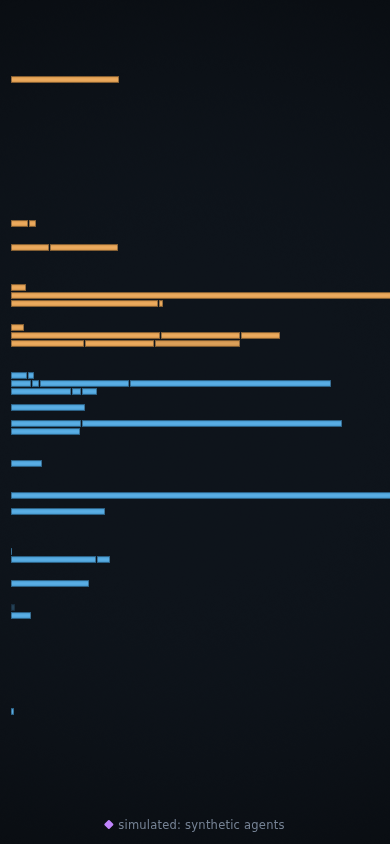

# price-time

**[Watch it live → price-time.netlify.app](https://price-time.netlify.app)**
&nbsp;·&nbsp; [](https://github.com/CameronScarpati/price-time/actions/workflows/ci.yml)

**A live matching engine, made visible.** Open the page and you are watching a
real financial market breathe: every rectangle is one actual resting order on
Bitstamp's BTC/USD order book — buyers in blue pressing up from below, sellers
in amber pressing down from above, and between them a living gap, the spread,
that widens and knits back together dozens of times a minute. Nothing on screen
is decoration. Every mark is caused by a real order arriving, waiting,
cancelling, or trading, reconstructed order-by-order and run through a matching
engine built for this piece.

A piece by **Cameron Scarpati** — a view of the beauty living inside market
microstructure.


*Live mode on a thin night. The inspector is reading a real order: 1.73 BTC
offered at $63,929.88, first of five in its queue, waiting six seconds.*

## What is remarkable about this

Most market visualizations show you an aggregate: "400 shares at this price."
That number is a sum that has already destroyed the most human thing in the
market — **the queue**. At every price, orders wait in line, first come first
served. Whoever is at the front trades first; everyone behind waits, and
mostly waits in vain, because on a real book about 99.7% of orders are
cancelled, not filled. The line — who is ahead of whom, how long they have
waited, who gets paid — is where the market's texture lives, and it is
invisible in almost every public feed.

This piece runs on the rare exception: Bitstamp publishes a public,
order-by-order event stream (every individual create, change, and delete, with
ids). Those events are rebuilt into a full book by a deterministic price-time
matching engine — the same kind of single-sequencer state machine a real venue
runs — and the rendering draws each order as its own cell, in its true queue
position, with its age as brightness. New orders arrive bright and settle;
old ones dim to embers. Zoom out and the cell separators fall below a pixel,
queues optically melt into solid depth — you literally watch order-by-order
data aggregate into the "market depth" picture everyone else starts from.

Things worth waiting for: a **sweep** (one aggressive order eating through
several price levels — a run of flashes climbing the book, and the price
simply *is* somewhere else afterward); the **refill**, as makers pour quotes
back into the hole; **cancel storms**, when the flicker doubles because the
quoting machines all change their minds at once; and on quiet nights, a
market so thin that a single arriving order is an event. The piece notices
these moments and narrates them in one quiet line.


*The engaged chrome: mid and spread in the gap, price rules, the tape of
recent trades. This shot is from simulated mode (the label at the bottom
always tells you), where synthetic agents drive the same engine.*

## Is it real?

Yes — with one honest caveat, disclosed on the page itself. The order flow is
Bitstamp's public feed; the book, queues, fills and cancels you see are
reconstructed from it through a local engine and verified continuously against
the venue's own published book. In a calm 20-minute audit, the rebuilt
top-of-book matched the venue **exactly — zero ticks of difference — on all
118 samples** across 115,790 applied events with zero sequence gaps. In a
60-minute audit run deliberately through a violent selloff, 340 of 346
samples matched within one tick (98.3%), with zero gaps and a single
divergence that the watchdog caught and healed by rebuilding the book — which
is the designed response, since a wrong book is thrown away, never patched
(raw reports in `docs/perf/`). At rare margins a local match can differ from
the venue's internal one; the piece never claims to *be* Bitstamp's engine,
only Bitstamp's flow through an honest one.

When the feed drops — venues go down, tabs go offline — the piece never shows
a spinner. Synthetic traders seeded from the last real book and calibrated to
its recent texture keep the market breathing, and the label at the bottom
changes to say so *before* the first simulated pixel appears. There are three
modes, always labeled: **live**, **replay** (a recorded real session, bundled,
used when a device shouldn't stream), and **simulated**.


*The phone gets its own composition — price down the long axis, the spread gap
at the center of the screen — not a shrunken desktop.*

## Running it

```
pnpm install
pnpm dev        # open http://localhost:5173
pnpm test       # engine invariants, reconstruction golden tests, determinism
pnpm build      # static site in dist/ — deploys to any static host
```

Useful URL parameters: `?hud=1` (frame-time HUD) · `?mode=synthetic&seed=42`
(deterministic simulation) · `?mode=replay` (bundled recorded session).
Keyboard: space pauses (live events buffer and catch up ×8, labeled), `?`
opens the explainer. Hover or tap any order for its queue position and age.

## How it is built

TypeScript, zero runtime dependencies. A Web Worker owns all truth — the
WebSocket, the snapshot-plus-delta reconstruction (with exact gap detection
over Bitstamp's event-id chain, and a discard-and-reseed rule: wrong books are
thrown away, never patched), the matching engine, and the phenomenon
detectors. The main thread owns all looking — a WebGL2 instanced renderer, a
spring camera, and every decay and stagger. Market state crosses between them
once per frame as a transferred binary buffer. The engine itself is a pure
deterministic state machine tested with generative property tests: never a
crossed book, exact FIFO priority, per-order quantity conservation, cancels
final, byte-identical replays. `docs/design.md` holds every decision and its
reasoning; `docs/brief.md` is the research it stands on.

Performance, honestly: the worker packs the full ~8,700-order live book in
1.27ms; shipped JS is ~22KB gzipped against a 150KB budget; book state
coalesces to one repaint per frame while trade events are never dropped. The
stated frame budget (p99 ≤ 16.7ms over a five-minute soak) is written for
mid-range phones and **has not yet been measured on real phone hardware** —
this repo was built in an environment with software-rendered GL only, whose
frame numbers would be meaningless to quote. The HUD (`?hud=1`) exists so
that measurement is one tap away on a real device.

## Honest limitations

- Bitstamp is effectively the only keyless public order-by-order feed, so live
  mode has a single upstream; that is why the synthetic understudy is
  load-bearing and built to the same event interface.
- The venue snapshot doesn't carry order creation times, so ages are known
  only from arrival onward — a freshly seeded book starts its clocks at zero.
- Stops, icebergs-as-certainty, pegs, and hidden orders aren't shown: the
  public feed cannot express them. What you see is the displayed book, which
  is itself not the whole market — the explainer says so.
- Screenshots above show the market that existed when they were taken; a thin
  Sunday and a violent Tuesday look nothing alike. That is the point.

## Credits

Built by Cameron Scarpati. Market data: [Bitstamp](https://www.bitstamp.net)
(BTC/USD public WebSocket and REST feeds), attributed on the page and consumed
directly by your browser — no relay, no key, nothing stored. Code is
[MIT-licensed](LICENSE); the market data remains Bitstamp's, under
[their terms](https://www.bitstamp.net/api/).
